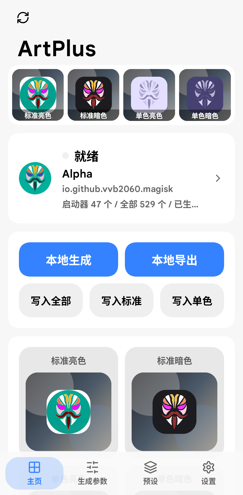
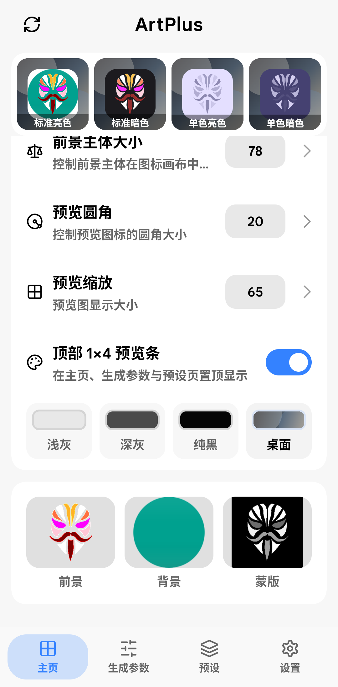
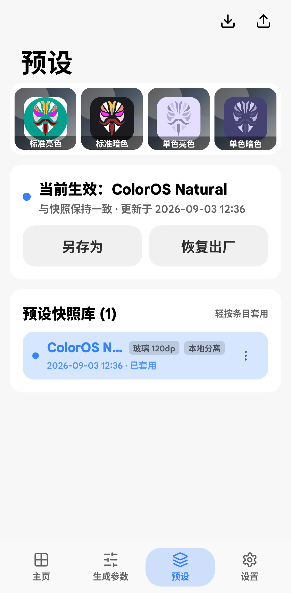
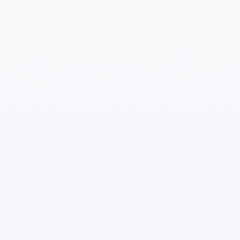
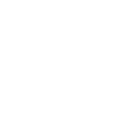

<div align="center">

# ArtPlus 移动端

<p>专为 ColorOS 设计的 ART+ 图标分层提取、算法重构与实时多态预览工具</p>

[](https://developer.android.com)
[](https://kotlinlang.org)
[](https://developer.android.com/jetpack/compose)
[](https://github.com)
[](LICENSE)

</div>

---

## 📱 界面预览

<div align="center">
<table>
  <tr>
    <td align="center" width="33%">
      <br />
      <b>主页与多态预览</b><br />
      <sub>日间/暗色/单色及顶部预览条</sub>
    </td>
    <td align="center" width="33%">
      <br />
      <b>图层拆解与调试</b><br />
      <sub>前景/背景/蒙版多层分离校准</sub>
    </td>
    <td align="center" width="33%">
      <br />
      <b>预设快照管理</b><br />
      <sub>特性标签与导入导出生态</sub>
    </td>
  </tr>
</table>
</div>

---

## 🎨 ART+ 图标分层输出规范

ArtPlus 自动将第三方应用普通图标解构并标准化生成 ColorOS ART+ 原生规范资产包：

<div align="center">
<table>
  <tr>
    <th align="center">应用原始图标</th>
    <th align="center">前景层 (recfg)</th>
    <th align="center">背景层 (recbg)</th>
    <th align="center">深色模式 (rec_night)</th>
    <th align="center">单色图标 (monochrome)</th>
  </tr>
  <tr>
    <td align="center"><br /><sub><b>原始图标</b></sub></td>
    <td align="center"><br /><sub><b>主体前景</b></sub></td>
    <td align="center"><br /><sub><b>背景延展</b></sub></td>
    <td align="center"><br /><sub><b>暗色适配</b></sub></td>
    <td align="center"><br /><sub><b>单色提取</b></sub></td>
  </tr>
  <tr>
    <td align="center"><code>icon.png</code></td>
    <td align="center"><code>recfg.png</code></td>
    <td align="center"><code>recbg.png</code></td>
    <td align="center"><code>rec_night.png</code></td>
    <td align="center"><code>monochrome.png</code></td>
  </tr>
</table>
</div>

> 此外，自动派生生成 ColorOS 多比例磁贴尺寸支持（`1x2`、`2x1`、`2x2`），完美契合系统桌面个性化排版。

---

## ✨ 主要功能

- **📲 应用检索与读取**：快速读取已安装应用列表，区分启动器应用与后台组件，支持一键定位目标 App。
- **🧩 智能图层分离**：支持本地分层算法，具备智能背景清理、前景修整边缘平滑、字标保全与单色图标生成。
- **👁️ 全态实时预览**：在手机端无缝实时渲染标准亮色、标准暗色、单色亮色、单色暗色以及 1×4 顶部条状态。
- **🧪 预设快照库**：支持预设特征标签、调参快照保存、单条配置复制与系统剪贴板一键导出/导入。
- **⚡ Root 极速写入**：支持一键直写系统 ART+ 目录（`/data/oplus/uxicons/`），配备防误触二次确认与自动刷新桌面机制。
- **🤖 可选 AI 扩展**：支持接入在线图像生成与处理接口，探索未来感图标候选设计。

---

## 📂 项目结构

```text
ArtPlus/
├── mobile/            # Android 移动端应用源码 (Kotlin + Jetpack Compose)
│   └── src/main/
│       ├── kotlin/    # 核心业务逻辑、图层算法与界面组件
│       └── res/       # 原生 Android 资源配置
├── docs/              # 开发设计文档、发布日志与 README 展示资源
│   └── assets/        # README 高清预览截图与演示图标
├── uxicons/           # 已整理的标准 ART+ 图标资源
├── theme/             # 主题相关模板与样式
└── outputs/           # 生成结果、临时预览图及构建产物
```

---

## 🛠️ 本地构建

编译前请确保本机环境满足以下要求：
- JDK 17 及以上
- Android SDK (API 34+)
- Gradle 8.14+

```bash
# 构建 Debug 安装包
./gradlew :mobile:assembleDebug

# 构建 Release 安装包
./gradlew :mobile:assembleRelease
```

构建完成后，APK 安装包输出路径：

```text
mobile/build/outputs/apk/debug/mobile-debug.apk
mobile/build/outputs/apk/release/mobile-release.apk
```

---

## 🚀 持续集成与发布

仓库集成了自动化 GitHub Actions 工作流：
- 手动触发或推送版本 Tag 时，自动执行全量构建。
- 自动生成打包校验文件与 release 产物，保证签名纯净安全。
